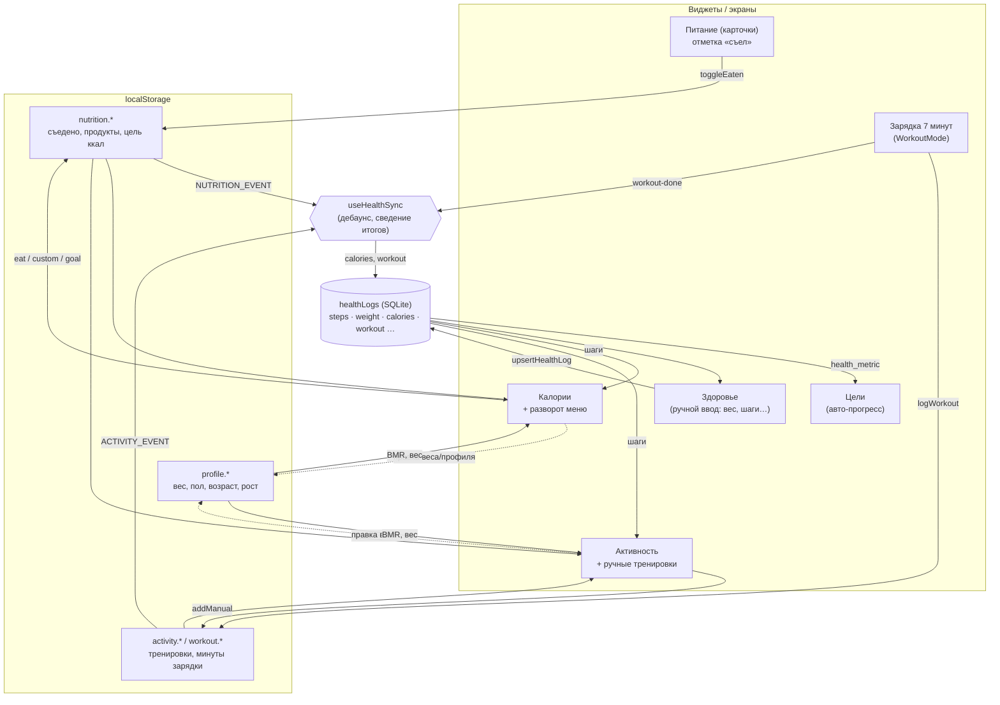

# THEDAD — синхронизация виджетов и потоки данных

Как связаны виджеты здоровья/питания/активности и почему изменение в одном месте
отражается везде. Кратко: **всё сходится в `healthLogs`** (единый лог метрик), а виджеты
общаются через события `window`.

## Слои хранения

| Хранилище | Что лежит | Модуль |
|---|---|---|
| **SQLite (IndexedDB)** через `useStore` | `healthLogs` (steps, weight, **calories**, **workout**, sleep, water, energy), goals, tasks, habits… | `lib/store.ts` |
| **localStorage** | съеденное за день, цель ккал, свои продукты | `lib/nutrition.ts` |
| **localStorage** | зарядка (секунды/день), ручные тренировки | `lib/activity.ts` |
| **localStorage** | профиль: вес, пол, возраст, рост | `lib/profile.ts` |

`healthLogs` — **канонический слой**. К нему привязан авто-прогресс целей
(`goal.health_metric`) и виджет «Здоровье». Локальные фичи (питание/зарядка/активность)
держат «сырые» данные у себя, а дневные итоги сводят в `healthLogs`.

## События (шина `window`)

| Событие | Кто шлёт | Кто слушает |
|---|---|---|
| `thedad:nutrition-changed` (`NUTRITION_EVENT`) | любое изменение еды/продуктов/цели ккал | Калории, Активность, `useHealthSync` |
| `thedad:activity-changed` (`ACTIVITY_EVENT`) | зарядка, ручные тренировки | Активность, Калории, `useHealthSync` |
| `thedad:workout-done` | конец зарядки (`WorkoutMode`) | виджет Зарядка, `useHealthSync` |
| `thedad:profile-changed` (`PROFILE_EVENT`) | смена веса/пола/возраста/роста | Калории, Активность |
| `thedad:plugins-changed` (`PLUGINS_EVENT`) | установка/удаление плагина | Дашборд, Калории |

## Единая точка сведе́ния — `useHealthSync`

`lib/healthSync.ts` монтируется один раз в `App`. Слушает события еды/активности/зарядки
и (с дебаунсом 300мс) пишет дневные итоги в `healthLogs`:

- `calories` = сумма съеденного за сегодня (как только появилась первая отметка «съел»);
- `workout` = минуты зарядки за сегодня.

Виджеты больше **не** пишут в `healthLogs` напрямую — они только меняют свои сторы и шлют
события. Это убирает двойные записи и делает поток предсказуемым.



## Как считается баланс дня

```
баланс = съедено − (BMR покоя + активность)
активность = шаги·k(вес) + зарядка·MET(вес) + ручные тренировки
BMR = Миффлин-Сан-Жеор (пол, возраст, рост, вес)      // 0, если профиль не заполнен
```

Дефицит (баланс ≤ 0) → снижение веса; профицит → набор. Виджет «Калории» сверяет это
с целью по весу (цель в кг, где target < start) и с целью, привязанной к метрике `calories`.

## Точка расширения для экосистемы

Любой внешний источник (Apple Health, Health Connect, Google Fit, умные часы), который
пишет в `healthLogs` через `upsertHealthLog(date, metric, value)` — **автоматически**
прорастает во все виджеты и цели, без отдельной проводки. Именно поэтому `healthLogs`
выбран каноническим слоем. Подробности — в [ECOSYSTEM.md](./ECOSYSTEM.md).
